# AGH WIET Niestacjonarne Semestr 7

## Mateusz Popielarz

### Lab MongoDb - Raport

<div style="page-break-after: always;"></div>

# Zadania

## 4.  Za pomocą narzędzia Robo 3T wykonaj polecenie dodające do stworzonej bazy kolekcję „student”:


W MongoDB booster wybrałem 'Add collection' i wpisałem

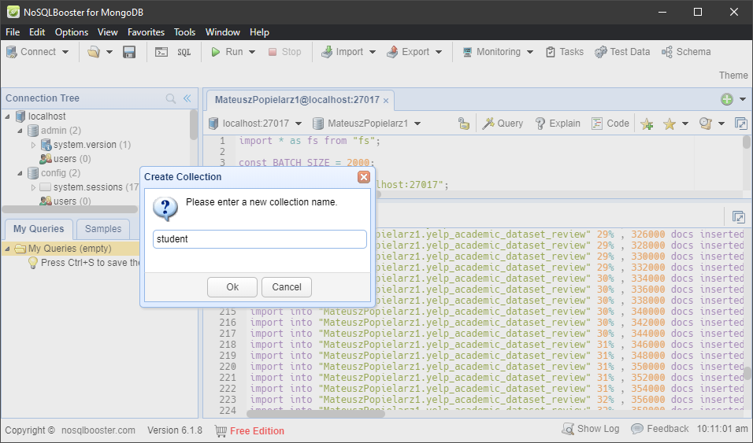

<div style="page-break-after: always;"></div>

### a) wprowadź własne dane do kolekcji: imię, nazwisko, obecność (typ bool), ocena z lab. (null), aktualna data, zaliczone przedmioty (min 3 przykładowe).
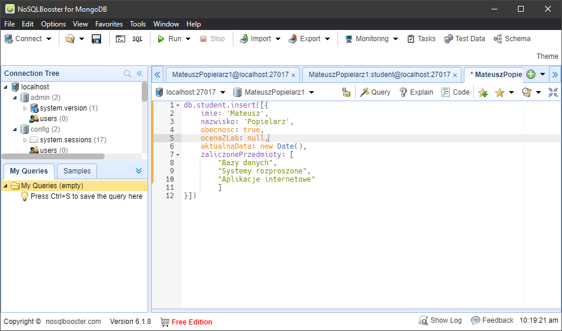

Dane wprowadzone według instrukcji

<div style="page-break-after: always;"></div>

### b) wyświetl wynik dodania danej w formie. json txt.
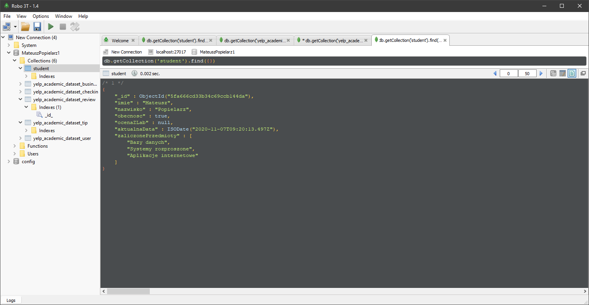

<div style="page-break-after: always;"></div>

## 5. Za pomocą narzędzia Robo 3T wykonaj zapytania, które pozwolą uzyskać następujące wyniki:

### a. ilość miejsc ocenianych na 5 gwiazdek (pole stars, kolekcja business) 
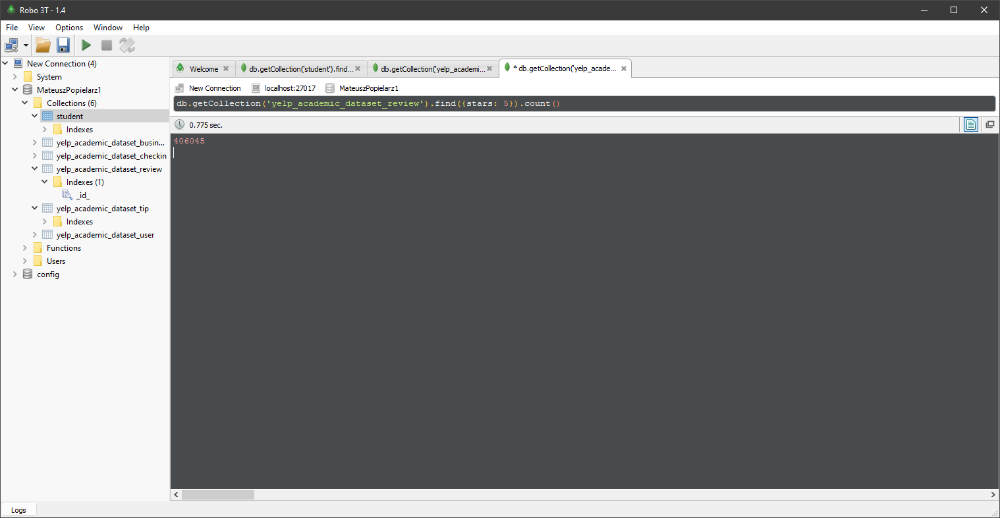

<div style="page-break-after: always;"></div>

### b. ilość restauracji w każdym mieście, wynik posortuj malejąco na podstawie liczby. Pole categories w dokumencie business musi zawierać wartość Restaurants.
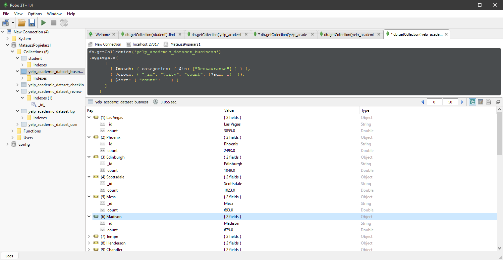

```
db.getCollection('yelp_academic_dataset_business')
.aggregate(
      [
        { $match: { categories: { $in: ["Restaurants"] } } },
        { $group: { "_id": "$city", "count": {$sum: 1}  }},
        { $sort: { "count": -1 } }
      ]
    )
```

<div style="page-break-after: always;"></div>

### c. ilość hoteli (atrybut categories powinien mieć wartość Hotels) w każdym stanie/okręgu (state), które posiadają darmowe Wi-fi (pole attributes, klucz-wartość ‘Wi-Fi’: ‘free’) oraz ocenę co najmniej 4.5 gwiazdki. Wykorzystaj funkcję group.

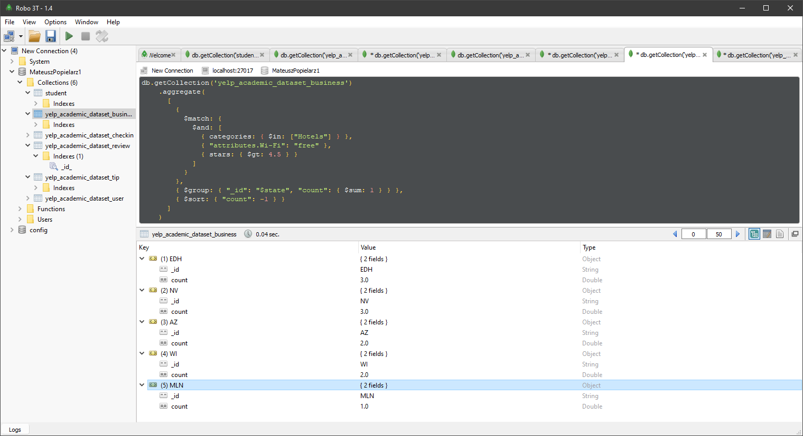
```
db.getCollection('yelp_academic_dataset_business')
    .aggregate(
      [
        {
          $match: {
            $and: [
              { categories: { $in: ["Hotels"] } },
              { "attributes.Wi-Fi": "free" },
              { stars: { $gt: 4.5 } }
            ]
          }
        },
        { $group: { "_id": "$state", "count": { $sum: 1 } } },
        { $sort: { "count": -1 } }
      ]
    )
```

<div style="page-break-after: always;"></div>

### d. zwróć, ile recenzji posiadają oceny z każdej kategorii: funny, cool, useful. Przypisanie recenzji do kategorii oznacza, że przynajmniej jedna osoba zagłosowała na recenzje w tej kategorii). Wykorzystaniem mechanizmu map-reduce.

W funkcji `map` emituje wartość 1, tylko jeżeli jakakolwiek recenzja została dodana.
W funkcji `reduce` zostaje mi tylko proste sumowanie. 

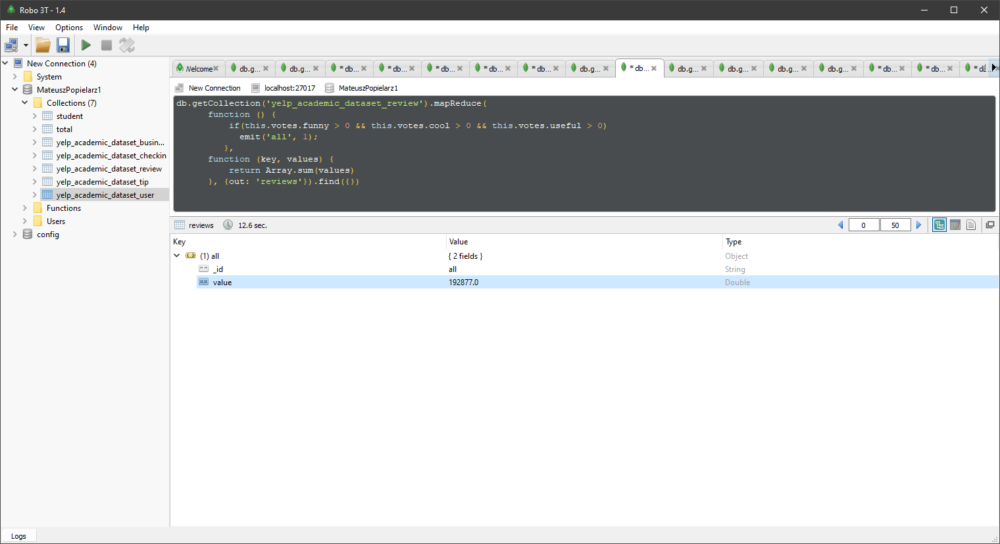

<div style="page-break-after: always;"></div>

#### 6. Wykonaj zadania punktu 5 z poziomu języka (TypeScript)

Użycie Node.Js w dialekcie `typescript` pozwala mi natywnie użyć składni mongodb.

Kod bootstrapera
```
import * as mongodb from 'mongodb';

const url = 'mongodb://localhost:27017';
const dbName = 'MateuszPopielarz1';
declare function emit(k, v);

// Use connect method to connect to the server
mongodb.connect(url, async function (err, client) {
  console.error(err);
  console.log("Connected successfully to server");
  const db = client.db(dbName);

  await excerciseA(db);
  await excerciseB(db);
  await excerciseC(db);
  await excerciseD(db);
  await excercise7(db);

  client.close();
});
```

`emit` musi zostać zadeklarowany, bo nie istnieje w globalnym scope TS


<div style="page-break-after: always;"></div>

### a. a. ilość miejsc ocenianych na 5 gwiazdek (pole stars, kolekcja business) 
```

async function excerciseA(db: mongodb.Db) {
  const count = await db.collection('yelp_academic_dataset_review').find({ stars: 5 }).count();
  console.log(`Zadanie A: Count: ${count}`);
}
```

Wynik wykonania

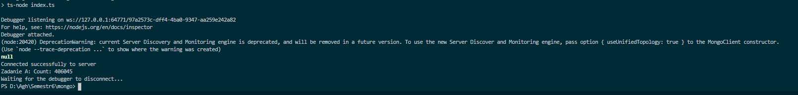

<div style="page-break-after: always;"></div>

### b. ilość restauracji w każdym mieście, wynik posortuj malejąco na podstawie liczby. Pole categories w dokumencie business musi zawierać wartość Restaurants.

```

async function excerciseB(db: mongodb.Db) {

  const data = await db.collection('yelp_academic_dataset_business').aggregate(
    [
      { $match: { categories: { $in: ["Restaurants"] } } },
      { $group: { "_id": "$city", "count": { $sum: 1 } } },
      { $sort: { "count": -1 } }
    ]
  ).toArray();

  console.log("Zadanie B", data);
}
```
Rezultat: 

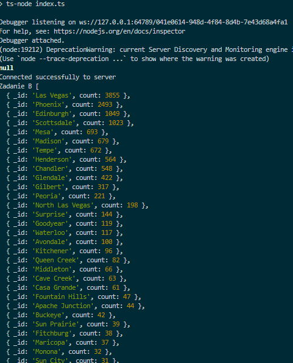

<div style="page-break-after: always;"></div>

### c.  ilość hoteli (atrybut categories powinien mieć wartość Hotels) w każdym stanie/okręgu (state), które posiadają darmowe Wi-fi (pole attributes, klucz-wartość ‘Wi-Fi’: ‘free’) oraz ocenę co najmniej 4.5 gwiazdki. Wykorzystaj funkcję group.
```
async function excerciseC(db: mongodb.Db) {
  const data = await db.collection('yelp_academic_dataset_business')
    .aggregate(
      [
        {
          $match: {
            $and: [
              { categories: { $in: ["Hotels"] } },
              { "attributes.Wi-Fi": "free" },
              { stars: { $gt: 4.5 } }
            ]
          }
        },
        { $group: { "_id": "$state", "count": { $sum: 1 } } },
        { $sort: { "count": -1 } }
      ]
    ).toArray();

  console.log("Zadanie C", data);
}
```

Rezultat wykonania:

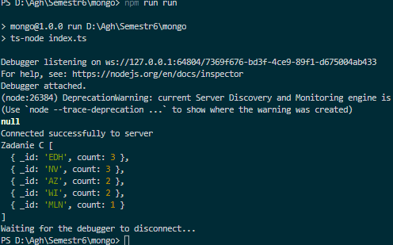


<div style="page-break-after: always;"></div>

### D. zwróć, ile recenzji posiadają oceny z każdej kategorii: funny, cool, useful. Przypisanie recenzji do kategorii oznacza, że przynajmniej jedna osoba zagłosowała na recenzje w tej kategorii). Wykorzystaniem mechanizmu map-reduce.

```

async function excerciseD(db: mongodb.Db) {

  const data = await db.collection('yelp_academic_dataset_review').mapReduce(
    function () {
      if (this.votes.funny > 0)
      if (this.votes.cool > 0)
      if (this.votes.useful > 0)
        emit('all', 1);
    },
    function (key, values: number[]) {
      return values.reduce((x, acc) => x + acc);

    }, { out: 'reviews' as {} } as mongodb.MapReduceOptions);

  const result = await db.collection('reviews').find({}).toArray();
  console.log("Zadanie D", result);
}

```

Rezultat wykonania:

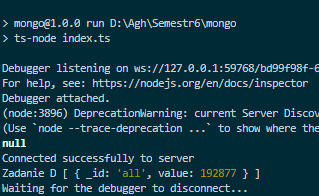

<div style="page-break-after: always;"></div>

## 7.Napisz kod w języku Java (metoda), który zwróci użytkownika (nazwa użytkownika) o największej liczbie pozytywnych recenzji (ocena co najmniej 4.5). 
```
async function excercise7(db: mongodb.Db) {
  const data = await db.collection('yelp_academic_dataset_review').aggregate(
    [
      { $match: { stars: { $gt: 4.5 } } },
      { $group: { "_id": "$user_id", "count": { $sum: 1 } } },
      { $sort: { "count": -1 } },
    ]
  ).toArray();
  const first = data[0];

  const userId = await db.collection('yelp_academic_dataset_user').findOne({ user_id: first['_id'] })
  console.log("Zadanie 7: ", userId['name']);
}

```

Do zrealizowania tego  zadania użyłem najpierw grupowania po `user_id`, gdzie ilość gwiazdek > 4.5, posortowałem po ilości, a następnie 
poszukałem w kolekcji `yelp_academic_dataset_user` odpowiadającego `user_id` i wypisałem  


Rezultat wykonania:

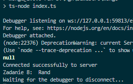